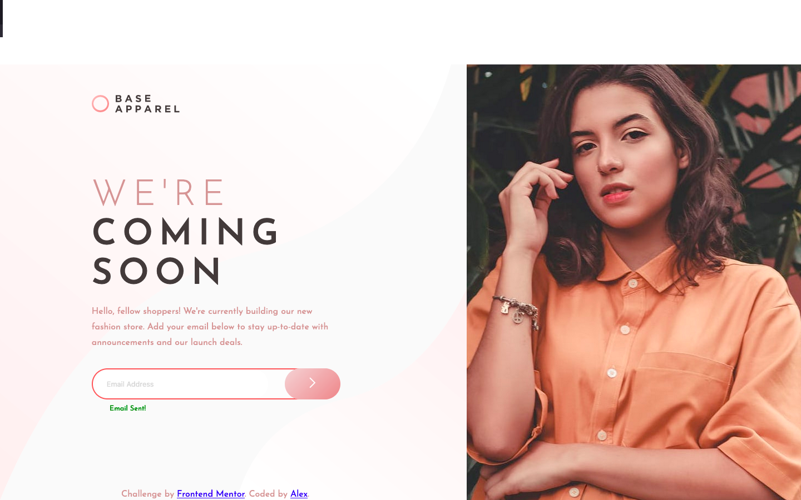

s
# Frontend Mentor - Base Apparel coming soon page solution

This is a solution to the [Base Apparel coming soon page challenge on Frontend Mentor](https://www.frontendmentor.io/challenges/base-apparel-coming-soon-page-5d46b47f8db8a7063f9331a0). Frontend Mentor challenges help you improve your coding skills by building realistic projects. 

## Table of contents

- [Progress Log](#Progress-Log)
- [Overview](#overview)
  - [The challenge](#the-challenge)
  - [Screenshot](#screenshot)
  - [Links](#links)
- [My process](#my-process)
  - [Built with](#built-with)
  - [What I learned](#what-i-learned)
  - [Continued development](#continued-development)
  - [Useful resources](#useful-resources)
- [Author](#author)
- [Acknowledgments](#acknowledgments)

**Note: Delete this note and update the table of contents based on what sections you keep.**

## Progress-Log:

  #### 01/31/2022, 2257 CDT:  
  Before you continue, reorganize the semantic elements and figure out how to properly position the hero image.
  
  #### 2/03/2022, 0354 CDT:  
  commenting the margins out within the text.css file removed the whitespace at the top of the body (when looking in the desktop screen).
  - I never realized the degree of specificity involved when working solely on positions and block placement. I need to go over both CSS inheritance and specificity to better understand the more minor details that I skimmed through.    

  Here some objectives to complete before the next commit:
   - Create a third querey that goes beyond a landscaped width of 1280 pixels.
   - Center both the page-content and footer (with the footer being horizontally alligned with the page-content).
   - Find the appropriate percentages for said blocks to better the page's overall responsiveness.
   - pretty-up the rest of the page and remove the border guides.
   - revise class names to better fit the BEM naming convention. 
  #### 02/04/2022, Part 1/2, 1924 CDT:  
  After scanning through various articles on the web, I was finally able to find the code to center the hero image on the desktop version of the page. In the proccess of this, relying solely on floats and block positioning has forced me to gain a better idea of certain concepts such as inheritance, the box-model, and surface-level basics of pseudo-elements (which adds an additional 'block' to the model).
  - This is one of two planned commits for the rest of the day. The next one will actually focus on previous obejectives.
  - ~~Turns out that adding the max-height property was the missing piece in fitting the hero image into the aside container (technically the pseudo-element), allowing it the overall picture to be vertically centered.~~
    - ~~Figuring this out took about 7 hours an ungodly amount of time.~~   
  - ~~There wasn't a need to set the footer's position to absolute in the mobile platform, but it was absolutely (pun-intended) needed for the desktop platform due to said tag being outside of the rest of the content. Doing so removes the footer from the flow, which places (technically) it inside the main content.~~
  #### 02/05/2022
  Styled the desktop page (with a width of 1440) a bit more.
   - After realising how little I know about positioning, proper box styling, and "legacy Layouts, I'm going to dive more into CSS fundamentals. 

   #### 03/15/2022
   It's been well over a month of trying to figure out how to position certain objects (specifically centering the hero image) without the aid of table displays, legacy grids (such as 960), flexbox, and CSS grids. Obviously, it didn't pan out well. How did developers go about positioning just using floats and clears? 
   - Decided to apply the table display to the hero image by wrapping it within two containers, allowing me to vertically center it without the need to lose hair about it. 
   - Removed the border "guides" and completed the basic design for both mobile and desktop. 
   - Added the gradient SVG background.
     - Unsure if it should be a background image using CSS. With that, the SVG is awkward due to the pattern abruptly stopping. I need to learn how to use gradients with CSS. 
     - Now I just need to apply Javascript.

  #### 03/23/2022
  Applying a gradient transition was a bit tricky since CSS doesn't have a mehtodology to directly deal with that. As a result, and after some digging on the web, applying a transition to a gradient could only be achieved by transition an element's (and it's subsequent pseudo-element) opacity to what it was (::)before. The next step is to create an error message within the body (in contrast to the common alert function) using AJAX and Regex. Sure, it's much easier utilizing JQuery for something such as this, but I need to understand how to apply this knowing my code with confidence.
  - changed `background-color` to `background-image` in order to utilize gradient transition.
    - the button color would have changed abrutly without smooth animation if I were to use `background-color` instead.
  - Created a `::before` pseudo-element for my `.btn` class in order to have both elements.
  - changed CSS color values to RGB and RGBA due to HSL not supporting the specific color I needed for the button.
  - Applying AJAX to both detect and inform the client if they made an error (invalid email) directly below the input field using a transitionary fade-in animation. The input's border should also transition with an equal speed and smoothness as the message and button. This border, message, and button, will disspear once it the client's email is validated, meaning that it'll make use of recognizing a wide variety of Regular Expressions. 


#### 05/09/2022
After trying to understand the reason why all the elements within the form tag looked softer in contrast to the original Figma file, it occured to me (I should also give credit to Stackoverflow for assistance) that all the child selectors within the `<form>` tag had an opacity of .5, which naturally made every single element, even SVG files, susceptible to deviating away from their assigned color. To resolve this, removing the opacity property from the form selector and replacing the color value from RGB to RGBA for all child selectors removed te issue completely.
&nbsp;&nbsp;&nbsp;&nbsp;I began adding the error shading, but I need to utilize Javascript to form CSS transitions based on Regex. As it turns out, this doesn't require AJAX.

#### 05/10/2022
Remember:
- The regular border for `form.email` is `border: 1px solid rgba(206, 152, 152, .5);`
  - Once an invalid address is entered, the border is `border: 2px solid rgb(249, 100, 100);`
  - `icon-error` has a defaulted display of none, except when the address is invalid.
- `margin-top` for `input.email--input` is set to -.5px if border is set to 2px; it will be -1px if border is 1px.
- `margin-top` for `.btn` is set to -2px once border is set to 2px. -1px if border is 1px.

#### 05/11/2022; 1556
I tested out an algorithm that I found through doing some digging on Github. One of which was
```js
function init (){
  submit.addEventListener('click', function() {
    if(!reg.test(input.value.toLowerCase())){
      formBorder.style.border = "2px solid rgb(249, 100, 100)";
      iconError.style.disply = "inline-block";
      errorText.style.display = "inline-block";
    } else {
      formBorder.style.border = "1 px solid green";
      errorText.innerHTML = "Email Sent!";
      errorText.style.color = "green";
      iconError.style.display = "none";
    }
    input.value = "";  
  })
}
```
Of course, this code was partially edited to work for my page. The now resolved issue that stemmed from working hrough this was involving the HTML. Although the email input's border changed color and stroke, the page immediately reoladed, completely going back to it's default appearance. The issue started due to my use of a form tag, which is, what I now know, used to send and recieve data from a server. replacing `<form>` with a regular `<div>` tag worked solely for testing out if the code entered worked.
&nbsp;&nbsp;&nbsp;&nbsp;On another note, it would be better to turn those conditional statements into a function for reuse. If the user is to click on the button multiple times after the invalid email is correct, the border will remain in the same state it was when it initially changed.


## Overview

### Project objectives

There are a few challenges that I made for myself in the process of creating this branch:  
- I'm a stubborn dude, and in order to understand CSS fundamentals, I'm gonna focus  
on creating the layout by altering block positions using both floats and clears.  
  - this excludes the use of flexbox and CSS grids. Although some may not see  
  the point in taking these extra steps, this porject serves more as an experiment  
  that'll allow me to better understand how programmers managed to configure layouts without the convenient newer technologies we have now.
    - on a side note, I will ~not~ be using table grids...for now.
- By confining myself to these restrictions, I'll better understand how to manipulate the DOM from various perspectives using Javascript.
- This also serves as practice for better understanding git and virtual control systems as a whole.


### The challenge

Users should be able to:

- View the optimal layout for the site depending on their device's screen size
- See hover states for all interactive elements on the page
- Receive an error message when the `form` is submitted if:
  - The `input` field is empty
  - The email address is not formatted correctly

### Screenshot


Add a screenshot of your solution. The easiest way to do this is to use Firefox to view your project, right-click the page and select "Take a Screenshot". You can choose either a full-height screenshot or a cropped one based on how long the page is. If it's very long, it might be best to crop it.

Alternatively, you can use a tool like [FireShot](https://getfireshot.com/) to take the screenshot. FireShot has a free option, so you don't need to purchase it. 

Then crop/optimize/edit your image however you like, add it to your project, and update the file path in the image above.

**Note: Delete this note and the paragraphs above when you add your screenshot. If you prefer not to add a screenshot, feel free to remove this entire section.**

### Links

- Solution URL: [Add solution URL here](https://your-solution-url.com)
- Live Site URL: [Add live site URL here](https://your-live-site-url.com)

## My process

### Built with

- Semantic HTML5 markup
- CSS custom properties
- Floats
- positioning
- Mobile-first workflow
- [React](https://reactjs.org/) - JS library
- [Next.js](https://nextjs.org/) - React framework
- [Styled Components](https://styled-components.com/) - For styles

**Note: These are just examples. Delete this note and replace the list above with your own choices**

### What I learned

Use this section to recap over some of your major learnings while working through this project. Writing these out and providing code samples of areas you want to highlight is a great way to reinforce your own knowledge.

To see how you can add code snippets, see below:

```html
<h1>Some HTML code I'm proud of</h1>
```
```css
.proud-of-this-css {
  color: papayawhip;
}
```
```js
const proudOfThisFunc = () => {
  console.log('🎉')
}
```

If you want more help with writing markdown, we'd recommend checking out [The Markdown Guide](https://www.markdownguide.org/) to learn more.

**Note: Delete this note and the content within this section and replace with your own learnings.**

### Continued development

Use this section to outline areas that you want to continue focusing on in future projects. These could be concepts you're still not completely comfortable with or techniques you found useful that you want to refine and perfect.

**Note: Delete this note and the content within this section and replace with your own plans for continued development.**

### Useful resources

- [Example resource 1](https://www.example.com) - This helped me for XYZ reason. I really liked this pattern and will use it going forward.
- [Example resource 2](https://www.example.com) - This is an amazing article which helped me finally understand XYZ. I'd recommend it to anyone still learning this concept.

**Note: Delete this note and replace the list above with resources that helped you during the challenge. These could come in handy for anyone viewing your solution or for yourself when you look back on this project in the future.**

## Author

- Website - [Add your name here](https://www.your-site.com)
- Frontend Mentor - [@yourusername](https://www.frontendmentor.io/profile/yourusername)
- Twitter - [@yourusername](https://www.twitter.com/yourusername)

**Note: Delete this note and add/remove/edit lines above based on what links you'd like to share.**

## Acknowledgments

This is where you can give a hat tip to anyone who helped you out on this project. Perhaps you worked in a team or got some inspiration from someone else's solution. This is the perfect place to give them some credit.

**Note: Delete this note and edit this section's content as necessary. If you completed this challenge by yourself, feel free to delete this section entirely.**
